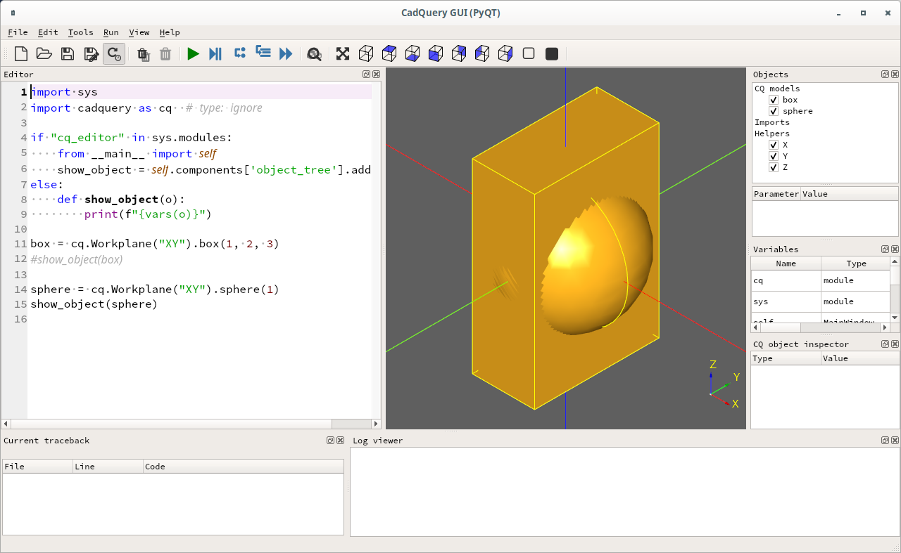

# test show_object

The technique of using importing show_object via __main__ doesn't work:
```
if "cq_editor" in sys.modules:
  from __main__ import self
  show_object = self.components['object_tree'].addObject
```

My test case, z.py is very simple:
```  
import sys
import cadquery as cq  # type: ignore

if "cq_editor" in sys.modules:
    from __main__ import self
    show_object = self.components['object_tree'].addObject
else:
    def show_object(o):
        print(f"{vars(o)}")

box = cq.Workplane("XY").box(1, 2, 3)
#show_object(box)

sphere = cq.Workplane("XY").sphere(1)
show_object(sphere)
```
When the above code is executed with `python z.py` only one "show_object" is seen:
```
(cq-dev) wink@3900x:~/prgs/CadQuery/projects/show_object_test (master)
$ python z.py
{'plane': <cadquery.occ_impl.geom.Plane object at 0x7fa156ff7c90>, 'objects': [<cadquery.occ_impl.shapes.Solid object at 0x7fa156ff7990>], 'parent': <cadquery.cq.Workplane object at 0x7fa157fa8790>, 'ctx': <cadquery.cq.CQContext object at 0x7fa15777f890>, '_tag': None}
```

But when I execute `cq-editor z.py` both the box and sphere are shown.
Which is the result we would expect if there were no `show_object` calls.

Have I done something wrong?


